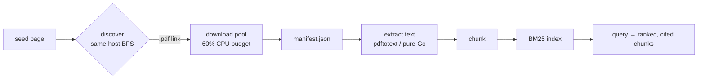

# Vellum

<p align="center">
  <a href="LICENSE"></a>
  <a href="#"></a>
  <a href="#"></a>
  <a href="#"></a>
</p>

**Vellum** is an ultra-lightweight retrieval-augmented question answering
system over Oxford Capital Strategies' public-domain trading research. It
crawls the site, downloads every PDF, indexes the text, and answers questions
with cited evidence — all in one static Go binary, on a laptop CPU, with no GPU
and no paid LLM/embedding API.

The pipeline is three commands:

```sh
vellum scrape   # download every PDF into data/ and write data/manifest.json
vellum ingest   # extract text from the PDFs and build a BM25 index (data/index.json)
vellum query    # "your question" → ranked, cited chunks
```

## Install

```sh
git clone https://github.com/DeanT-04/oxford-strat-RAG.git
cd oxford-strat-RAG
go build -o bin/vellum ./cmd/vellum
```

Requires Go 1.26+. Or install directly:

```sh
go install github.com/DeanT-04/oxford-strat-RAG/cmd/vellum@latest
```

## Usage

```sh
# 1. Discover and download every PDF
vellum scrape          # or -dry-run to preview

# 2. Extract text and build the index
vellum ingest

# 3. Ask questions
vellum query "value and momentum across asset classes"
vellum query -k 10 "how does the turtle trading system enter trades"
```

Scrape flags:

| Flag | Default | Meaning |
| --- | --- | --- |
| `-url` | `https://oxfordstrat.com/resources/` | seed page to crawl |
| `-out` | `data` | directory for downloaded files |
| `-concurrency` | `0` | download workers; `0` = auto (60% of CPUs) |
| `-depth` | `2` | same-host crawl depth |
| `-resume` | `false` | skip already-downloaded files |
| `-politeness` | `250ms` | minimum interval between requests |

Run `vellum <cmd> -h` for the complete flag list. Scrape flags can also be set
via `VELLUM_*` environment variables (flags win over env, env wins over
defaults).

## Query output

Each result is a BM25-ranked chunk with its source PDF:

```text
[1] 20.4838  Value and Momentum Everywhere
    source: ValMomEverywhere.pdf
    average Sharpe ratio across markets, indicating strong correlation structure …
[2] 20.2127  Value and Momentum Everywhere
    source: ValMomEverywhere.pdf
    This correlation structure—value being positively correlated across assets …
```

`data/manifest.json` records every download (URL, final URL, local path,
SHA-256, size, status); `data/index.json` is the queryable index.

## How it works



- **Polite crawling** — browser User-Agent, timeouts, exponential backoff, a
  minimum interval between requests.
- **Safe I/O** — sanitized filenames, path-containment guards, atomic writes.
- **Ultra-lightweight retrieval** — pure-Go BM25, in-memory, no GPU and no
  embedding service; query latency is microseconds for this corpus.
- **Grounded answers** — every result carries its source PDF filename, so the
  host agent answers only from retrieved evidence.

Details: [ARCHITECTURE.md](ARCHITECTURE.md).

## Skill

A Reasonix skill (`/vellum-rag`, in `.reasonix/skills/vellum-rag/SKILL.md`)
wraps `vellum query` so the agent answers from retrieved chunks — no extra
LLM or embedding API key is required.

## Development

```sh
go vet ./...     # static analysis (must stay clean)
go test ./...    # unit tests (no network; httptest + stubs)
go test -cover ./...
```

Coverage is measured with
`go test -coverprofile=coverage.out ./... && go tool cover -func=coverage.out`.

## Known limitations

- External academic PDFs are fetched from their original hosts; some may be
  slow or unreachable and are recorded as `failed` in the manifest.
- Three PDFs are image-only scans with no text layer and are skipped at ingest;
  they would need OCR (not included).
- Retrieval is lexical (BM25) — precise for exact terms but not semantic.
  Dense embeddings can be added behind the same `Extractor`/index seam later.

## License

[MIT](LICENSE) © 2026 DeanT-04
