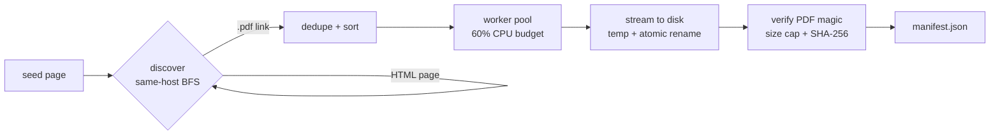

# Vellum

<p align="center">
  <a href="LICENSE"></a>
  <a href="#"></a>
  <a href="#"></a>
  <a href="#"></a>
</p>

**Vellum** crawls Oxford Capital Strategies' public-domain trading research and
downloads every PDF into a local, machine-readable archive — the foundation for
an ultra-lightweight retrieval-augmented question answering system.

Vellum is a single static Go binary with no runtime dependencies. It runs on a
laptop CPU (no GPU required), keeps itself within a ~60% CPU budget by default,
and produces a `manifest.json` that a later RAG phase consumes directly. This
repository currently ships the **scraper**; ingestion and querying land next.

## Install

```sh
git clone https://github.com/DeanT-04/oxford-strat-RAG.git
cd oxford-strat-RAG
go build -o bin/vellum ./cmd/vellum
```

Requires Go 1.26+. Or install directly:

```sh
go install github.com/DeanT-04/oxford-strat-RAG/cmd/vellum@latest
```

## Usage

```sh
# Discover and report PDFs without downloading
vellum scrape -dry-run

# Download every discovered PDF into ./data and write data/manifest.json
vellum scrape

# Full control
vellum scrape -url https://oxfordstrat.com/resources/ \
  -out data -depth 2 -concurrency 4 -resume -verbose
```

Common flags:

| Flag | Default | Meaning |
| --- | --- | --- |
| `-url` | `https://oxfordstrat.com/resources/` | seed page to crawl |
| `-out` | `data` | directory for downloaded files |
| `-manifest` | `data/manifest.json` | JSON manifest path |
| `-concurrency` | `0` | download workers; `0` = auto (60% of CPUs) |
| `-depth` | `2` | same-host crawl depth |
| `-resume` | `false` | skip already-downloaded files |
| `-dry-run` | `false` | discover only, download nothing |
| `-politeness` | `250ms` | minimum interval between requests |

Run `vellum scrape -h` for the complete list. Every flag can also be set via a
`VELLUM_*` environment variable (flags win over env, env wins over defaults):

```sh
VELLUM_SEED_URL=... VELLUM_OUTPUT_DIR=... VELLUM_CONCURRENCY=... vellum scrape
```

## Output

Downloads land in `-out` (default `data/`) and a `manifest.json` records the
outcome of every discovered PDF — source URL, final URL, local path, SHA-256,
size, content type, and status:

```json
{
  "generated_at": "2026-08-16T14:41:00Z",
  "seed": "https://oxfordstrat.com/resources/",
  "count": 31,
  "entries": [
    {
      "url": "https://oxfordstrat.com/coasdfASD32/uploads/2016/01/turtle-rules.pdf",
      "final_url": "https://oxfordstrat.com/coasdfASD32/uploads/2016/01/turtle-rules.pdf",
      "local_path": "turtle-rules.pdf",
      "size": 140352,
      "sha256": "9f86d081884c7d659a2feaa0c55ad015a3bf4f1b2b0b822cd15d6c15b0f00a08",
      "content_type": "application/pdf",
      "status": "downloaded",
      "found_on": "https://oxfordstrat.com/resources/articles/",
      "title": "The Original Turtle Trading Rules",
      "fetched_at": "2026-08-16T14:41:00Z"
    }
  ]
}
```

## How it works



- **Polite crawling** — browser User-Agent, per-request timeouts, exponential
  backoff, and a minimum interval between requests (no hammering the host).
- **Best-effort discovery** — a single unreachable page is skipped, not fatal;
  only the seed page is required.
- **Safe I/O** — filenames are derived from URL basenames and sanitized;
  writes are atomic; nothing outside the output directory is ever touched.
- **Bounded resources** — the worker count defaults to 60% of logical CPUs and
  every body is size-capped.

Details: [ARCHITECTURE.md](ARCHITECTURE.md).

## Development

```sh
go vet ./...     # static analysis (must stay clean)
go test ./...    # unit tests (no network; httptest + stubs)
go test -cover ./...
```

Tests are table-driven and colocated with their packages. Coverage is measured
with `go test -coverprofile=coverage.out ./... && go tool cover -func=coverage.out`.

## Known limitations

- External academic PDFs are fetched from their original hosts; some may be
  slow or unreachable from certain networks and are recorded as `failed` in
  the manifest rather than retried forever.
- The strategy/indicator *articles* themselves are not yet archived — only the
  linked PDFs. Ingesting article text is part of the RAG phase.
- Cross-host downloads use the same politeness budget, so a full run can take a
  minute or two by design.

## License

[MIT](LICENSE) © 2026 DeanT-04
