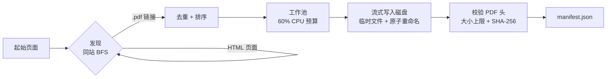

# Vellum

<p align="center">
  <a href="LICENSE"></a>
  <a href="#"></a>
  <a href="#"></a>
  <a href="#"></a>
</p>

**Vellum** 抓取 Oxford Capital Strategies 的公开领域交易研究资料，把每一份
PDF 下载到本地并生成机器可读的归档清单 —— 这是构建超轻量级检索增强问答
（RAG）系统的基础。

Vellum 是一个单一的 Go 静态二进制文件，无运行时依赖，无需 GPU，在笔记本
CPU 上即可运行，默认把自身控制在约 60% 的 CPU 预算内，并输出可供后续 RAG
阶段直接消费的 `manifest.json`。本仓库当前提供 **scraper（抓取器）**；
文本抽取与查询功能将在下一阶段加入。

## 安装

```sh
git clone https://github.com/DeanT-04/oxford-strat-RAG.git
cd oxford-strat-RAG
go build -o bin/vellum ./cmd/vellum
```

需要 Go 1.26+。也可以直接安装：

```sh
go install github.com/DeanT-04/oxford-strat-RAG/cmd/vellum@latest
```

## 用法

```sh
# 仅发现并列出 PDF，不下载
vellum scrape -dry-run

# 下载所有发现的 PDF 到 ./data，并写入 data/manifest.json
vellum scrape

# 完全自定义
vellum scrape -url https://oxfordstrat.com/resources/ \
  -out data -depth 2 -concurrency 4 -resume -verbose
```

常用参数：

| 参数 | 默认值 | 含义 |
| --- | --- | --- |
| `-url` | `https://oxfordstrat.com/resources/` | 抓取起始页面 |
| `-out` | `data` | 下载文件目录 |
| `-manifest` | `data/manifest.json` | JSON 清单路径 |
| `-concurrency` | `0` | 下载并发数；`0` = 自动（60% CPU） |
| `-depth` | `2` | 同站抓取深度 |
| `-resume` | `false` | 跳过已下载的文件 |
| `-dry-run` | `false` | 仅发现，不下载 |
| `-politeness` | `250ms` | 请求间最小间隔 |

完整参数列表见 `vellum scrape -h`。每个参数也可通过 `VELLUM_*` 环境变量
设置（命令行参数优先于环境变量，环境变量优先于默认值）：

```sh
VELLUM_SEED_URL=... VELLUM_OUTPUT_DIR=... VELLUM_CONCURRENCY=... vellum scrape
```

## 输出

下载的文件保存在 `-out`（默认 `data/`），`manifest.json` 记录每一份已发现
PDF 的结果 —— 源 URL、最终 URL、本地路径、SHA-256、大小、Content-Type 与
状态：

```json
{
  "generated_at": "2026-08-16T14:41:00Z",
  "seed": "https://oxfordstrat.com/resources/",
  "count": 31,
  "entries": [
    {
      "url": "https://oxfordstrat.com/coasdfASD32/uploads/2016/01/turtle-rules.pdf",
      "local_path": "turtle-rules.pdf",
      "size": 140352,
      "sha256": "9f86d081884c7d659a2feaa0c55ad015a3bf4f1b2b0b822cd15d6c15b0f00a08",
      "content_type": "application/pdf",
      "status": "downloaded",
      "found_on": "https://oxfordstrat.com/resources/articles/",
      "title": "The Original Turtle Trading Rules"
    }
  ]
}
```

## 工作原理



- **礼貌抓取** —— 浏览器 User-Agent、每次请求超时、指数退避、请求间最小间隔。
- **尽力而为的发现** —— 单个页面失败会被跳过而不会中断；只有起始页是必需的。
- **安全 I/O** —— 文件名由 URL 基名清洗而来；写入是原子的；绝不触碰输出目录之外。
- **资源受限** —— 默认并发数为逻辑 CPU 的 60%，每个响应体都有大小上限。

详情见 [ARCHITECTURE.md](ARCHITECTURE.md)（中文版：[docs/zh-CN/ARCHITECTURE.md](docs/zh-CN/ARCHITECTURE.md)）。

## 开发

```sh
go vet ./...     # 静态分析（必须保持干净）
go test ./...    # 单元测试（不访问网络；httptest + stub）
go test -cover ./...
```

测试与代码同目录放置，采用表驱动风格。覆盖率通过
`go test -coverprofile=coverage.out ./... && go tool cover -func=coverage.out`
统计。

## 已知限制

- 外部学术 PDF 从原始主机下载；某些网络下可能较慢或不可达，会在 manifest 中
  记录为 `failed` 而不会无限重试。
- 策略/指标 *文章页面* 本身尚未归档 —— 目前只归档链接到的 PDF；文章正文的
  抽取属于 RAG 阶段。
- 跨主机下载共用同一礼貌限速，因此完整运行按设计需要一两分钟。

## License

[MIT](LICENSE) © 2026 DeanT-04
