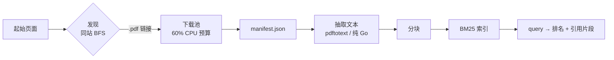

# Vellum

<p align="center">
  <a href="LICENSE"></a>
  <a href="#"></a>
  <a href="#"></a>
  <a href="#"></a>
</p>

**Vellum** 是一个超轻量级的检索增强问答系统，面向 Oxford Capital Strategies
的公开领域交易研究。它抓取网站、下载所有 PDF、索引正文，并用带引用的证据回答
问题 —— 全部在一个 Go 静态二进制里完成，笔记本 CPU 即可运行，无需 GPU，也无需
付费的 LLM / 向量化 API。

整条流水线只有三条命令：

```sh
vellum scrape   # 下载所有 PDF 到 data/ 并写入 data/manifest.json
vellum ingest   # 抽取 PDF 文本并构建 BM25 索引（data/index.json）
vellum query    # "你的问题" → 带排名的引用片段
```

## 安装

```sh
git clone https://github.com/DeanT-04/oxford-strat-RAG.git
cd oxford-strat-RAG
go build -o bin/vellum ./cmd/vellum
```

需要 Go 1.26+。也可以直接安装：

```sh
go install github.com/DeanT-04/oxford-strat-RAG/cmd/vellum@latest
```

## 用法

```sh
# 1. 发现并下载所有 PDF
vellum scrape          # 或加 -dry-run 预览

# 2. 抽取文本并构建索引
vellum ingest

# 3. 提问
vellum query "value and momentum across asset classes"
vellum query -k 10 "how does the turtle trading system enter trades"
```

Scrape 参数：

| 参数 | 默认值 | 含义 |
| --- | --- | --- |
| `-url` | `https://oxfordstrat.com/resources/` | 抓取起始页面 |
| `-out` | `data` | 下载文件目录 |
| `-concurrency` | `0` | 下载并发数；`0` = 自动（60% CPU） |
| `-depth` | `2` | 同站抓取深度 |
| `-resume` | `false` | 跳过已下载的文件 |
| `-politeness` | `250ms` | 请求间最小间隔 |

完整参数见 `vellum <cmd> -h`。Scrape 参数也可通过 `VELLUM_*` 环境变量设置
（命令行参数优先于环境变量，环境变量优先于默认值）。

## 查询输出

每个结果都是 BM25 排名的片段，并带源 PDF：

```text
[1] 20.4838  Value and Momentum Everywhere
    source: ValMomEverywhere.pdf
    average Sharpe ratio across markets, indicating strong correlation structure …
[2] 20.2127  Value and Momentum Everywhere
    source: ValMomEverywhere.pdf
    This correlation structure—value being positively correlated across assets …
```

`data/manifest.json` 记录每次下载（URL、最终 URL、本地路径、SHA-256、大小、
状态）；`data/index.json` 是可查询的索引。

## 工作原理



- **礼貌抓取** —— 浏览器 User-Agent、超时、指数退避、请求间最小间隔。
- **安全 I/O** —— 文件名清洗、路径包含防护、原子写入。
- **超轻量检索** —— 纯 Go BM25、内存内、无 GPU、无向量化服务；本语料库查询
  延迟为微秒级。
- **有据可依的回答** —— 每个结果都带源 PDF 文件名，宿主 agent 只依据检索到的
  证据作答。

详情见 [ARCHITECTURE.md](ARCHITECTURE.md)（中文版：
[docs/zh-CN/ARCHITECTURE.md](docs/zh-CN/ARCHITECTURE.md)）。

## Skill

一个 Reasonix skill（`/vellum-rag`，位于 `.reasonix/skills/vellum-rag/SKILL.md`）
封装了 `vellum query`，让 agent 依据检索片段作答 —— 无需额外 LLM 或向量化
API key。

## 开发

```sh
go vet ./...     # 静态分析（必须保持干净）
go test ./...    # 单元测试（不访问网络；httptest + stub）
go test -cover ./...
```

覆盖率通过
`go test -coverprofile=coverage.out ./... && go tool cover -func=coverage.out`
统计。

## 已知限制

- 外部学术 PDF 从原始主机下载；部分可能较慢或不可达，会在 manifest 中记录为
  `failed`。
- 三个 PDF 是纯扫描件（无文本层），ingest 时会跳过；需要 OCR（未包含）。
- 检索是词法级（BM25）—— 对精确术语很准，但不具备语义理解；未来可在同一
  `Extractor` / 索引接口之后加入稠密嵌入。

## License

[MIT](LICENSE) © 2026 DeanT-04
