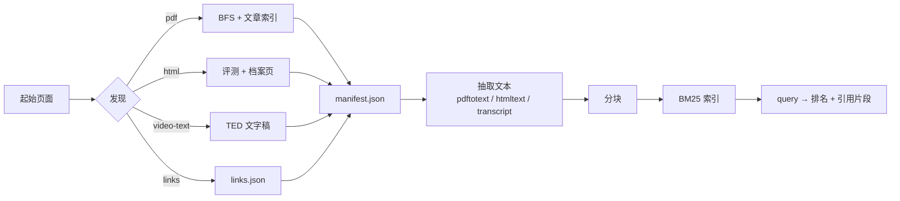

<p align="center">
  
</p>

<p align="center">
  <a href="LICENSE"></a>
  <a href="#"></a>
  <a href="#"></a>
  <a href="#"></a>
  <a href="#"></a>
</p>

**Vellum** 是一个超轻量级的检索增强问答系统，面向 Oxford Capital Strategies
的公开领域交易研究。它抓取网站，收集 **PDF、HTML 策略评测、思想者档案、精选
链接目录和 TED 演讲文字稿**，全部索引，并用带引用的证据回答问题 —— 全部在一个
Go 静态二进制里完成，笔记本 CPU 即可运行，无需 GPU，也无需付费的 LLM / 向量化
API。

流水线是三条命令（外加两个只读列表命令）：

```sh
vellum scrape   # 收集 PDF、HTML、链接、文字稿到 data/
vellum ingest   # 抽取全部文本并构建 BM25 索引
vellum query    # "你的问题" → 带排名的引用片段

vellum links    # 列出精选外部链接目录
vellum videos   # 列出演讲及其文字稿覆盖情况
```

## 安装

```sh
git clone https://github.com/DeanT-04/oxford-strat-RAG.git
cd oxford-strat-RAG
go build -o bin/vellum ./cmd/vellum
```

需要 Go 1.26+。也可以直接安装：

```sh
go install github.com/DeanT-04/oxford-strat-RAG/cmd/vellum@latest
```

## 用法

```sh
# 1. 收集全部内容（PDF + HTML 评测 + 链接 + 文字稿）
vellum scrape          # 或加 -dry-run 预览

# 2. 抽取文本并构建索引
vellum ingest

# 3. 提问
vellum query "value and momentum across asset classes"
vellum query -k 10 "how does the turtle trading system enter trades"
```

`scrape` 收集五种内容类型（默认 `--kinds pdf,html,links,video-text`）：

| 类型 | 收集内容 |
| --- | --- |
| `pdf` | 文章库中的每个 PDF —— 本站上传及外部主机（SSRN、CME 等），付费/失效链接记为 `reference` |
| `html` | 约 100 篇策略/指标/数据分析评测页（含 A–D 评级）及 4 个思想者档案页 |
| `links` | 精选外部链接目录 → `data/links.json` |
| `video-text` | TED 演讲的完整文字稿，带演讲者 + 演讲标题 + 来源 URL |

Scrape 参数：

| 参数 | 默认值 | 含义 |
| --- | --- | --- |
| `-url` | `https://oxfordstrat.com/resources/` | 抓取起始页面 |
| `-kinds` | `pdf,html,links,video-text` | 要收集的内容类型 |
| `-articles` | `https://oxfordstrat.com/resources/articles/` | 文章库索引 URL |
| `-out` | `data` | 下载文件目录 |
| `-concurrency` | `0` | 下载并发数；`0` = 自动（60% CPU） |
| `-depth` | `2` | 同站抓取深度 |
| `-resume` | `false` | 跳过已下载的文件 |
| `-politeness` | `250ms` | 请求间最小间隔 |

完整参数见 `vellum <cmd> -h`。Scrape 参数也可通过 `VELLUM_*` 环境变量设置
（命令行参数优先于环境变量，环境变量优先于默认值）。

## 查询输出

每个结果都是 BM25 排名的片段，并带来源与引用：

```text
[1] 20.4838  Value and Momentum Everywhere
    source: ValMomEverywhere.pdf
    average Sharpe ratio across markets, indicating strong correlation structure …
[2] 19.8120  NR7 Pattern (Test: Setup & Exit)
    source: nr7.html
    url:    https://oxfordstrat.com/trading-strategies/nr7/
    the NR7 setup looks for the narrowest range of the last seven bars …
```

`data/manifest.json` 记录每项内容（URL、类型、本地路径、SHA-256、大小、状态、
评级、演讲者）；`data/index.json` 是可查询的索引。

## 工作原理



- **礼貌抓取** —— 浏览器 User-Agent、超时、指数退避、请求间最小间隔，并拒绝
  跳转到环回/私有主机。
- **安全 I/O** —— 文件名清洗、路径包含防护、原子写入。
- **超轻量检索** —— 纯 Go BM25、内存内、无 GPU、无向量化服务；本语料库查询
  延迟为微秒级。
- **有据可依的回答** —— 每个片段都带来源 URL，宿主 agent 只依据检索到的证据
  作答。

详情见 [ARCHITECTURE.md](ARCHITECTURE.md)（中文版：
[docs/zh-CN/ARCHITECTURE.md](docs/zh-CN/ARCHITECTURE.md)）。

## Skill

一个 Reasonix skill（`/vellum-rag`，位于 `.reasonix/skills/vellum-rag/SKILL.md`）
封装了 `vellum query`，让 agent 依据检索片段作答 —— 无需额外 LLM 或向量化
API key。

## 开发

```sh
go vet ./...     # 静态分析（必须保持干净）
go test ./...    # 单元测试（不访问网络；httptest + stub）
go test -cover ./...
```

覆盖率通过
`go test -coverprofile=coverage.out ./... && go tool cover -func=coverage.out`
统计。

## 已知限制

- 外部学术 PDF 与 SSRN 论文从原始主机下载；不可达/付费的会记为 manifest 中的
  `reference`，而不是静默丢弃。
- 现代 TED 文字稿没有逐段时间戳，因此引用会指向演讲 + 演讲者，而非某个精确
  时刻。
- 唯一一个非 TED 演讲（CTA Masterclass）没有字幕，会记为 `needs_transcript`
  引用；未包含语音转写。
- 三个 PDF 是纯扫描件（无文本层），ingest 时会跳过；需要 OCR（未包含）。
- 检索是词法级（BM25）—— 对精确术语很准，但不具备语义理解；未来可在同一
  `Extractor` / 索引接口之后加入稠密嵌入。

## License

[MIT](LICENSE) © 2026 DeanT-04
